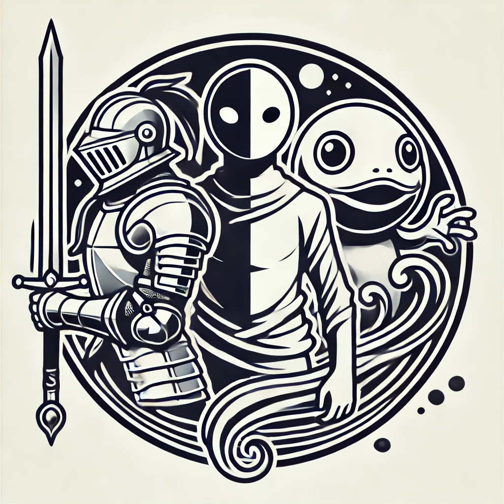

  <h1>Knights, Knaves and Kappas*</h1>  
  
    
  

      

----------

<tt>*<a href="https://en.wikipedia.org/wiki/Kappa_(folklore)">Kappas</a> are trickster spirits in Japanese folklore. Now, in some legegnds, they are helpful to humans, and in some they lure kids into water and eat them. So they are a blend of benevolence and malevolence.</tt> 
<tt>In our context, Kappas represent an entity <b>that may tell the truth or may lie</b>, Completely unpredictable 🤷‍♂️ (I know not culturally appropriate, but \*cough\* <i>sounds cool</i>)</i></tt>
